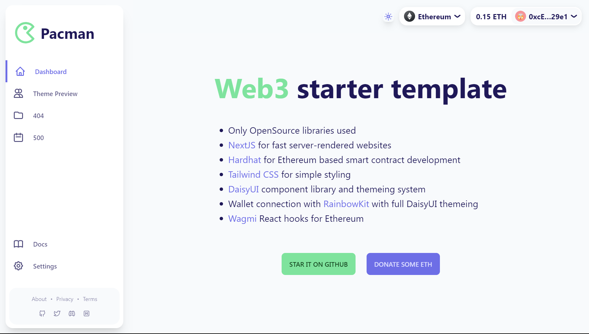
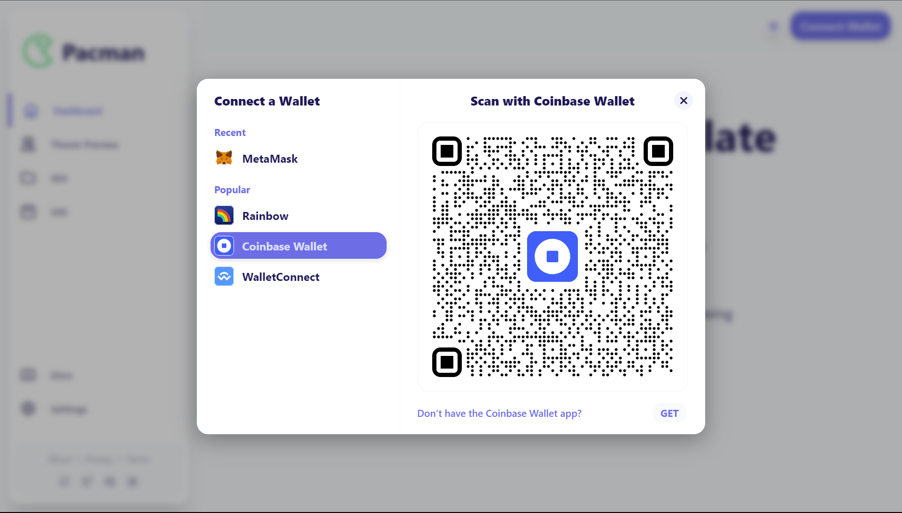
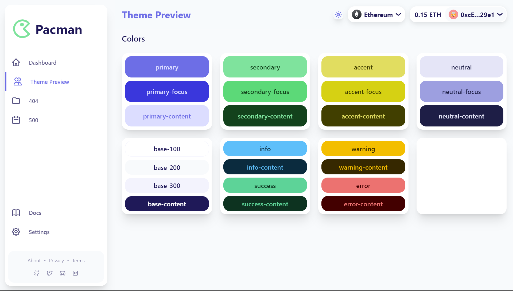
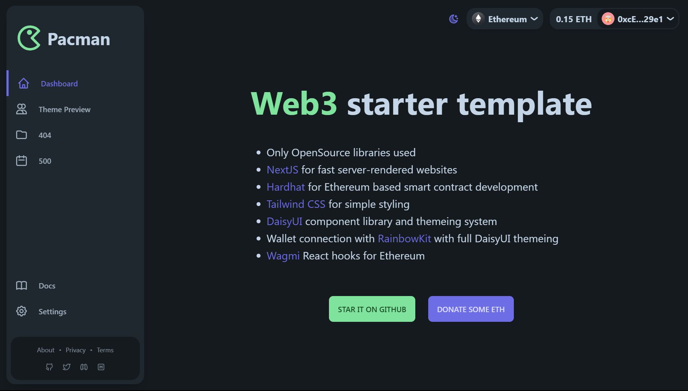
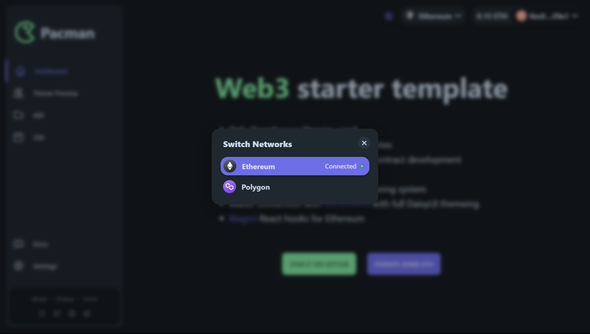
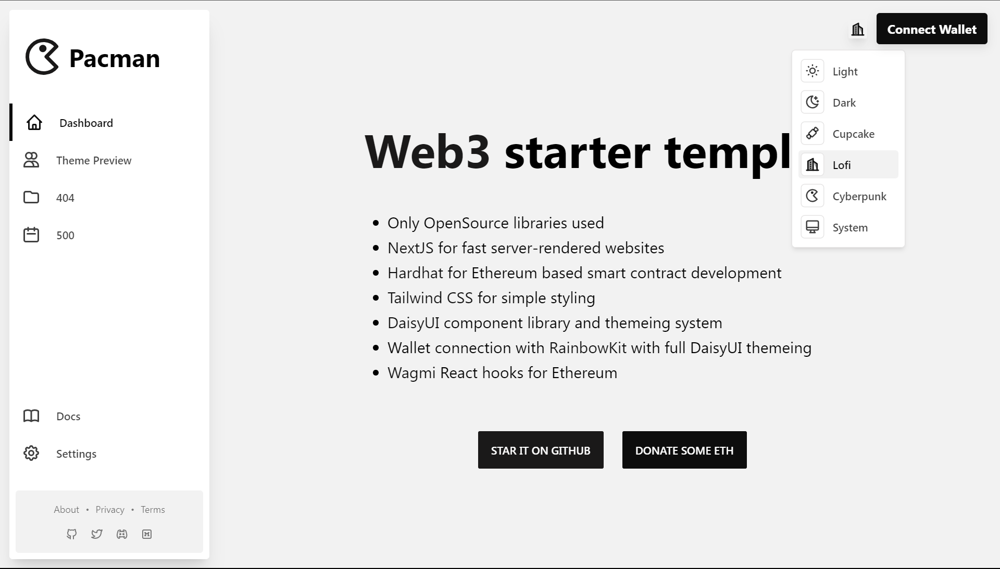
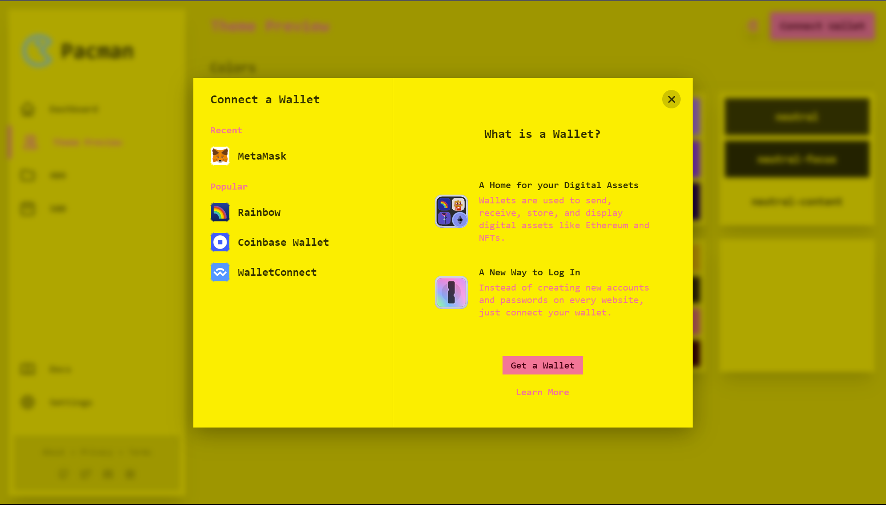

# 🚀 Web3 Starter Dashboard Template

Welcome to the Web3 Starter Dashboard Template! This template provides a powerful starting point for building your own web3 applications. It combines open-source libraries and frameworks to create a seamless development experience for building fast, secure, and stylish decentralized applications.

## Features

- 💻 NextJS: Fast server-rendered websites for optimal performance and SEO.
- 🏗️ Hardhat: Ethereum-based smart contract development framework for seamless integration with the Ethereum blockchain.
- 🎨 Tailwind CSS: Simple and intuitive styling framework for beautiful user interfaces.
- 🌼 DaisyUI: Component library and themeing system for creating stunning UI designs effortlessly.
- 💼 Wallet Connection: Seamless integration with RainbowKit for easy wallet connection, enabling users to interact with Ethereum securely.
- ⚡️ Wagmi React Hooks: Powerful React hooks for Ethereum, making it easier to interact with Ethereum smart contracts.

## Screenshots

### Light Theme





### Dark Theme




### Alternative Themes




## Getting Started

To get started with the Web3 Starter Dashboard Template, follow these steps:

1. Clone this repository to your local machine.
2. Install the necessary dependencies by running the command:
   ```
   npm install
   ```
3. Configure the required environment variables. Refer to the `.env.example` file for the necessary variables.
4. Customize and build your application according to your project requirements.
5. Start the development server using the command:
   ```
   npm run dev
   ```
6. Open your web browser and visit `http://localhost:3000` to see your web3 dashboard in action!

## Contributing

We welcome contributions to enhance and improve the Web3 Starter Dashboard Template. Feel free to open pull requests for bug fixes, new features, or improvements. Please refer to the [Contribution Guidelines](CONTRIBUTING.md) for more details.

## License

This project is licensed under the [MIT License](LICENSE).

---

We hope this Web3 Starter Dashboard Template empowers you to create amazing decentralized applications! Feel free to customize and modify it to suit your specific needs. If you encounter any issues or have any questions, don't hesitate to reach out. Happy building! 🎉
